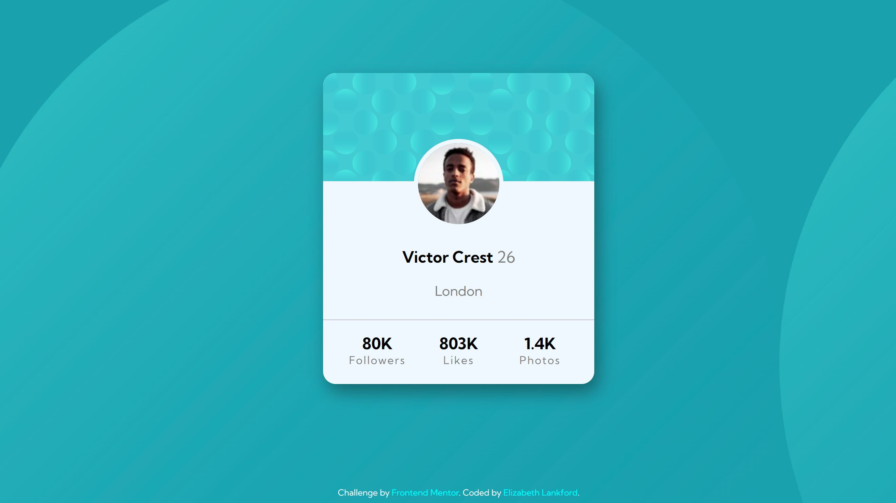
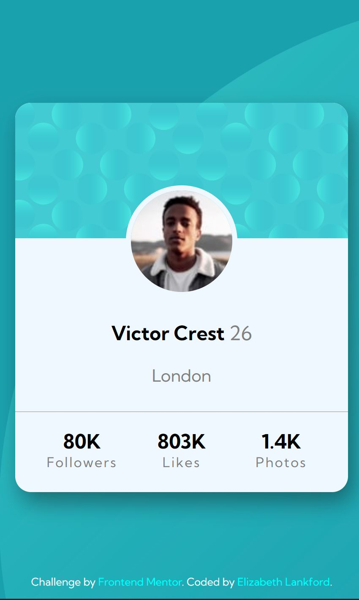

# Frontend Mentor - Profile card component solution

This is a solution to the [Profile card component challenge on Frontend Mentor](https://www.frontendmentor.io/challenges/profile-card-component-cfArpWshJ). Frontend Mentor challenges help you improve your coding skills by building realistic projects.

## Table of contents

- [Overview](#overview)
- [The challenge](#the-challenge)
- [Screenshot](#screenshot)
- [Links](#links)
- [My process](#my-process)
- [Built with](#built-with)
- [Continued development](#continued-development)
- [Useful resources](#useful-resources)
- [Author](#author)

## Overview

This was a Frontend Mentor challange to style a profile card component.

### The challenge

- Build out the project to the designs provided
  The design provided was static JPG images. I used best judgement for sizing, margin, and padding. I also strived to make the design responsive on both mobile and desktop devices.

### Screenshot

Below is a screenshot of the desktop view.

Below is a screenshot of the mobile view.

### Links

- Solution URL: [GitHub Repo](https://github.com/ElizabethLankford/frontend-mentor-profile-card)
- Live Site URL: [Live profile card](https://your-live-site-url.com)

## My process

Mobile-first approach
I first focused on a smaller screen size and used relative units for the sizing elements.

### Built with

- Semantic HTML5 markup
- CSS custom properties
- Flexbox
- Mobile-first workflow

### Continued development

For this project I focused on the mobile first approach. I found it to be easier to create a layout with a mobile device in mind and then worry about the resizing if viewed on a larger device.

**Note: Delete this note and the content within this section and replace with your own plans for continued development.**

### Useful resources

- [Google Fonts](https://fonts.google.com/specimen/Kumbh+Sans) - This helped me for XYZ reason. I really liked this pattern and will use it going forward.

## Author

- Website - [Elizabeth Lankford](https://elizabeth-lankford.com/)
- Frontend Mentor - [@ElizabethLankford](https://www.frontendmentor.io/profile/ElizabethLankford)
- LinkedIn - [Elizabeth Lankford](https://www.linkedin.com/in/elizabethlankford/)
